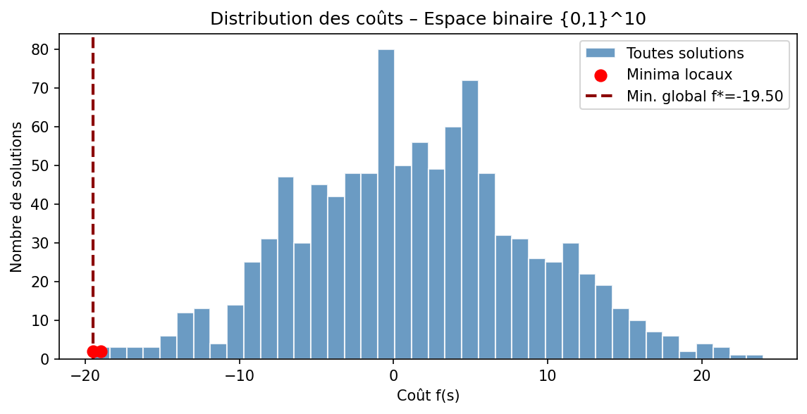
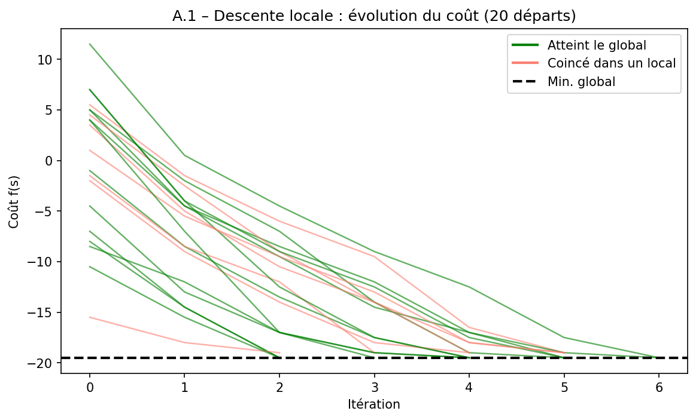
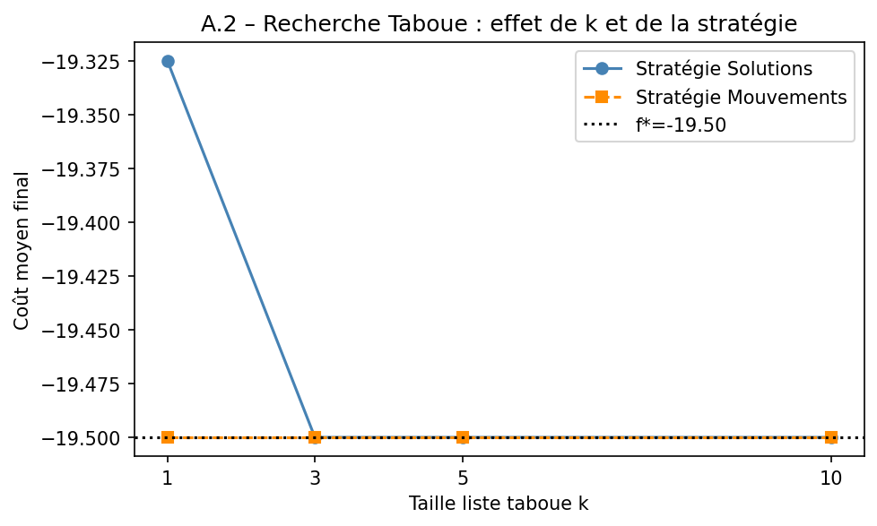
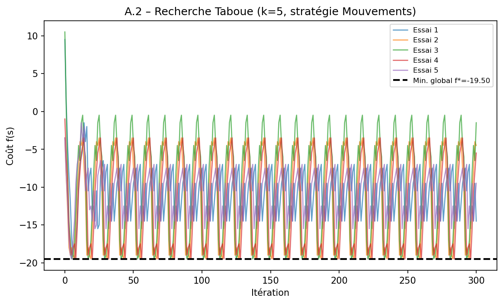
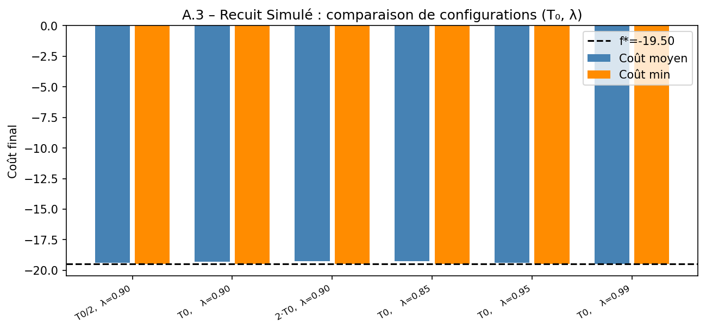
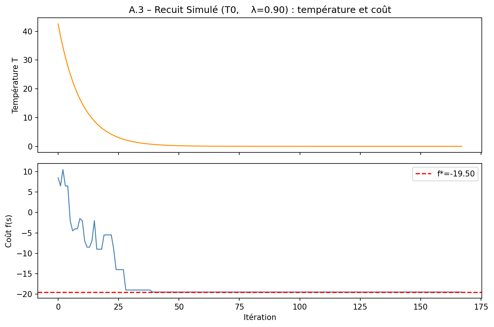
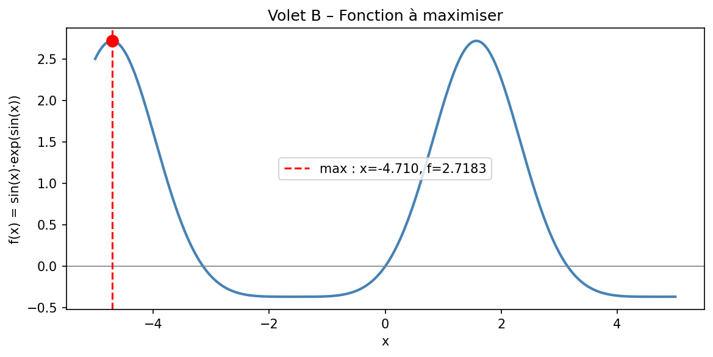
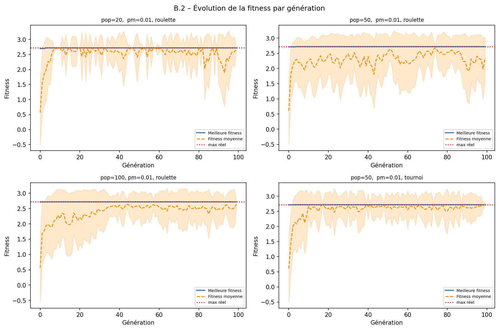
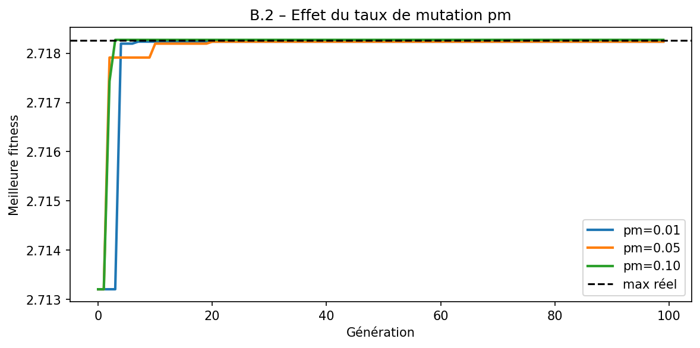
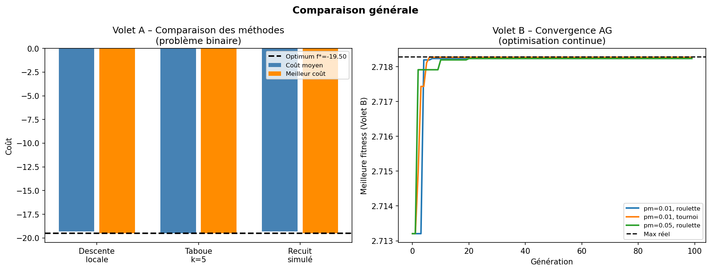

# Métaheuristiques et Optimisation — Mini-Projet Master

**Titre :** Conception, Implémentation et Évaluation Comparative de Métaheuristiques pour l'Optimisation sur Espaces Discrets et Continus  
**Filière :** Master – Optimisation et Recherche Opérationnelle  
**Établissement :** ENSET  
**Réalisé par :** Hicham Ouaouche  
**Encadré par :** Prof. Mestari

---

## Table des matières

1. [Description du projet](#1-description-du-projet)
2. [Structure du projet](#2-structure-du-projet)
3. [Installation et utilisation](#3-installation-et-utilisation)
4. [Volet A — Problème binaire](#4-volet-a--problème-binaire)
   - [4.1 Modélisation](#41-modélisation)
   - [4.2 Descente locale (A.1)](#42-descente-locale-a1)
   - [4.3 Recherche taboue (A.2)](#43-recherche-taboue-a2)
   - [4.4 Recuit simulé (A.3)](#44-recuit-simulé-a3)
5. [Volet B — Algorithme génétique](#5-volet-b--algorithme-génétique)
   - [5.1 Codage binaire (B.1)](#51-codage-binaire-b1)
   - [5.2 Opérateurs génétiques (B.2)](#52-opérateurs-génétiques-b2)
   - [5.3 Analyse des schèmes (B.3)](#53-analyse-des-schèmes-b3)
6. [Comparaison globale](#6-comparaison-globale)
7. [Figures générées](#7-figures-générées)
8. [Résultats numériques](#8-résultats-numériques)
9. [Discussion scientifique](#9-discussion-scientifique)
10. [Perspectives](#10-perspectives)

---

## 1. Description du projet

Ce mini-projet implémente, analyse et compare quatre **métaheuristiques** appliquées à deux types de problèmes d'optimisation :

| Volet | Problème | Méthodes |
|---|---|---|
| **A** | Minimisation sur `{0,1}^10` (espace discret binaire) | Descente locale, Recherche taboue, Recuit simulé |
| **B** | Maximisation de `f(x) = sin(x)·exp(sin(x))` sur `[-5, 5]` | Algorithme génétique |

La **problématique centrale** : *dans quelle mesure chaque métaheuristique parvient-elle à échapper aux minima locaux, et quels paramètres sont critiques pour la qualité des solutions ?*

---

## 2. Structure du projet

```
RO/
├── main.py                        # Point d'entrée — lance toutes les expériences
├── README.md                      # Ce fichier
├── Rapport_Metaheuristiques.docx  # Rapport scientifique complet (14 pages)
├── mini_projet_metaheuristiques.pdf  # Sujet du mini-projet
├── figures/                       # 10 figures PNG générées automatiquement
│   ├── A0_distribution_couts.png
│   ├── A1_descente_locale.png
│   ├── A2_tabu_k_strategie.png
│   ├── A2_tabu_evolution.png
│   ├── A3_recuit_comparaison.png
│   ├── A3_recuit_evolution.png
│   ├── B0_fonction.png
│   ├── B2_ag_convergence.png
│   ├── B2_ag_mutation.png
│   └── C_comparaison_globale.png
└── algorithmes/                   # Package Python — tous les modules d'algorithmes
    ├── __init__.py
    ├── problem.py                 # Définition du problème binaire (BinaryProblem)
    ├── local_search.py            # A.1 – Steepest descent
    ├── tabu_search.py             # A.2 – Recherche taboue (2 stratégies)
    ├── simulated_annealing.py     # A.3 – Recuit simulé
    └── genetic_algorithm.py      # B   – AG complet + analyse des schèmes
```

---

## 3. Installation et utilisation

### Prérequis

```bash
pip install numpy matplotlib
```

### Lancer toutes les expériences

```bash
python main.py
```

Le script exécute automatiquement tous les volets dans l'ordre, affiche les tableaux de résultats dans la console, et sauvegarde toutes les figures dans `figures/`. Toutes les expériences sont **reproductibles** grâce à `seed=42`.

### Lancer un algorithme individuellement

```python
from algorithmes.problem import BinaryProblem
from algorithmes.local_search import run_local_search, print_local_search_report

prob = BinaryProblem()
_, best_cost, _ = prob.brute_force()
results, stats = run_local_search(prob, n_starts=20, seed=42)
print_local_search_report(results, stats, best_cost)
```

---

## 4. Volet A — Problème binaire

### 4.1 Modélisation

**Espace de recherche :** vecteurs binaires `s = (b₁, …, b₁₀) ∈ {0,1}¹⁰` (n = 10 bits, voisinage Hamming-1).

**Fonction de coût (minimisation) :**

$$f(s) = \sum_{i=1}^{10} \alpha_i b_i + \sum_{1 \le i < j \le 10} \beta_{ij} b_i b_j$$

**Coefficients linéaires α :**

| Bit | b₀ | b₁ | b₂ | b₃ | b₄ | b₅ | b₆ | b₇ | b₈ | b₉ |
|---|---|---|---|---|---|---|---|---|---|---|
| αᵢ | -3.0 | +2.0 | -1.5 | +4.0 | -2.5 | +1.0 | -3.5 | +2.5 | -1.0 | +3.0 |

**Interactions β principales :**

| Paire (i,j) | βᵢⱼ | Rôle |
|---|---|---|
| (0,1) | +5.0 | Pénalise b₀=b₁=1 (conflit fort) |
| (0,4) | -4.0 | Récompense b₀=b₄=1 (synergie) |
| (2,6) | -3.5 | Récompense b₂=b₆=1 |
| (3,7) | +4.5 | Pénalise b₃=b₇=1 |
| (6,9) | -4.0 | Récompense b₆=b₉=1 |

**Vérification par force brute** (2¹⁰ = 1024 solutions) :

| Solution | f(s) | Type |
|---|---|---|
| `1010101011` | **-19.5000** | ✅ Minimum global |
| `1010111000` | -19.0000 | ⚠️ Minimum local |

> **Figure 1 — Distribution des coûts**



---

### 4.2 Descente locale (A.1)

**Algorithme :** steepest descent — à chaque itération, évalue tous les voisins Hamming-1 (n=10 voisins) et choisit le meilleur. S'arrête au premier minimum local.

**Paramètres :** 20 départs aléatoires, `seed=42`.

**Résultats (20 exécutions) :**

| # | Solution initiale | Solution finale | Coût final | Global ? |
|---|---|---|---|---|
| 1 | 0110010100 | 1010111000 | -19.0000 | — |
| 2 | 1111111010 | **1010101011** | **-19.5000** | ✅ |
| 3 | 1001110110 | **1010101011** | **-19.5000** | ✅ |
| 4 | 0001101101 | **1010101011** | **-19.5000** | ✅ |
| 5 | 0110010111 | **1010101011** | **-19.5000** | ✅ |
| 6 | 1000001011 | **1010101011** | **-19.5000** | ✅ |
| 7 | 1101001000 | 1010111000 | -19.0000 | — |
| 8 | 1000100011 | **1010101011** | **-19.5000** | ✅ |
| 9 | 1001110011 | **1010101011** | **-19.5000** | ✅ |
| 10 | 0110100110 | **1010101011** | **-19.5000** | ✅ |
| 11 | 1010111101 | 1010111000 | -19.0000 | — |
| 12 | 0110110000 | 1010111000 | -19.0000 | — |
| 13 | 0110110111 | **1010101011** | **-19.5000** | ✅ |
| 14 | 1101101000 | 1010111000 | -19.0000 | — |
| 15 | 1000110010 | **1010101011** | **-19.5000** | ✅ |
| 16 | 1010010111 | **1010101011** | **-19.5000** | ✅ |
| 17 | 1100010000 | 1010111000 | -19.0000 | — |
| 18 | 0011101011 | **1010101011** | **-19.5000** | ✅ |
| 19 | 1001000000 | 1010111000 | -19.0000 | — |
| 20 | 1110100001 | **1010101011** | **-19.5000** | ✅ |

**Analyse :**
- **P(global) = 13/20 = 65 %**
- Coût moyen final : **-19.3250** | Écart-type : **0.2385**
- Minima locaux atteints : `1010101011` (13×), `1010111000` (7×)
- Sensibilité : modérée — certains départs proches du global convergent en 2–3 itérations

> **Figure 2 — Descente locale : évolution du coût (20 départs)**
> *Vert = atteint le minimum global | Rouge = coincé dans un minimum local*



---

### 4.3 Recherche taboue (A.2)

**Deux stratégies de mémoire implémentées :**

- **Stratégie Solutions** : stocke les k dernières solutions visitées (interdit de les revisiter)
- **Stratégie Mouvements** : stocke les k derniers indices de bits flippés (interdit le mouvement inverse)
- **Critère d'aspiration** : lève l'interdiction si le mouvement tabou améliore le meilleur global connu

**Paramètres :** k ∈ {1, 3, 5, 10}, max_iter = 300, 20 départs, `seed=42`.

**Résultats comparatifs :**

| k | Stratégie | Coût moy. | Coût min. | P(global) | Dépl. moy. |
|---|---|---|---|---|---|
| 1 | Solutions | -19.3250 | -19.5000 | 65% | 300 |
| 1 | **Mouvements** | **-19.5000** | **-19.5000** | **100%** | 300 |
| 3 | Solutions | -19.5000 | -19.5000 | 100% | 300 |
| 3 | Mouvements | -19.5000 | -19.5000 | 100% | 300 |
| 5 | Solutions | -19.5000 | -19.5000 | 100% | 300 |
| 5 | Mouvements | -19.5000 | -19.5000 | 100% | 300 |
| 10 | Solutions | -19.5000 | -19.5000 | 100% | 300 |
| 10 | Mouvements | -19.5000 | -19.5000 | 100% | ⚠️ 11 |

> **Note :** k=10 (Mouvements) stoppe en 11 déplacements car les 10 bits sont tous simultanément tabous — aucun mouvement disponible sans aspiration.

> **Figure 3 — Effet de k et de la stratégie sur le coût moyen**



> **Figure 4 — Évolution du coût au cours des itérations (k=5, Mouvements)**



---

### 4.4 Recuit simulé (A.3)

**Règle d'acceptation :**

$$p = \begin{cases} 1 & \text{si } \Delta E \le 0 \\ e^{-\Delta E / T} & \text{si } \Delta E > 0 \end{cases}$$

**Calendrier de refroidissement :** $T_{k+1} = \lambda \cdot T_k$

**Estimation de T₀ :** `estimate_T0()` basée sur le **percentile 95 des dégradations ΔE > 0** observées sur 500 échantillons aléatoires, cible P(acceptation) ≈ 80% → **T₀ = 42.57**

**Paramètres :** 6 configurations (T₀, λ), 20 départs, max_iter = 3000, `seed=42`.

**Résultats comparatifs :**

| Configuration | Coût moy. | Coût min. | P(global) | Acc. dégr. | Itér. moy. |
|---|---|---|---|---|---|
| T₀/2, λ=0.90 | -19.3750 | -19.5000 | 75% | 12.58% | 162 |
| T₀, λ=0.90 | -19.3000 | -19.5000 | 60% | 15.12% | 168 |
| 2·T₀, λ=0.90 | -19.3250 | -19.5000 | 65% | 18.39% | 175 |
| T₀, λ=0.85 | -19.2250 | -19.5000 | 45% | 17.01% | 110 |
| T₀, λ=0.95 | -19.3500 | -19.5000 | 70% | 13.99% | 344 |
| **T₀, λ=0.99** | **-19.5000** | **-19.5000** | **100%** | 13.23% | **1749** |

> **Observation :** λ=0.99 atteint le global à 100% mais multiplie le temps de calcul par ~10. λ=0.85 converge trop vite et manque le global dans 55% des cas.

> **Figure 5 — Comparaison des 6 configurations du recuit simulé**



> **Figure 6 — Évolution de la température et du coût (T₀, λ=0.90)**



---

## 5. Volet B — Algorithme génétique

**Fonction objectif (maximisation) :**

$$f(x) = \sin(x) \cdot e^{\sin(x)}, \quad x \in [-5,\, 5]$$

**Maximum global :** $f^* \approx 2.7183$ atteint en $x \approx \pi/2 \approx 1.5708$ (et aussi en $x \approx -3\pi/2 \approx -4.712$).

> **Figure 7 — Fonction f(x) = sin(x)·exp(sin(x)) sur [-5, 5]**



---

### 5.1 Codage binaire (B.1)

**Représentation :** chromosomes de **10 bits** → phénotype réel dans [-5, 5].

**Formule de décodage :**

$$x = -5 + \text{décimal} \times \frac{10}{2^{10} - 1} = -5 + \text{décimal} \times \frac{10}{1023}$$

**Précision du codage :**

$$\Delta x = \frac{10}{1023} \approx 0.00977$$

**Exemples de chromosomes :**

| Chromosome (10 bits) | Décimal | x | f(x) |
|---|---|---|---|
| `0000000000` | 0 | -5.0000 | 2.5017 |
| `1111111111` | 1023 | +5.0000 | -0.3676 |
| `0101010101` | 341 | -1.6667 | -0.3679 |
| `1000000000` | 512 | +0.0049 | +0.0049 |

---

### 5.2 Opérateurs génétiques (B.2)

**Architecture de l'AG :**

| Composant | Implémentation |
|---|---|
| Initialisation | Population aléatoire uniforme |
| Sélection | Roulette proportionnelle **ou** Tournoi (k=3) |
| Croisement | Bipoints avec probabilité `pc` |
| Mutation | Bit-flip indépendant avec probabilité `pm` |
| Élitisme | Meilleur individu toujours conservé |

**8 configurations testées :**

| Configuration | x trouvé | f(x) | Erreur vs f* |
|---|---|---|---|
| pop=20, pm=0.01, roulette | -4.7067 | 2.718195 | 8.65×10⁻⁵ |
| pop=50, pm=0.01, roulette | -4.7165 | 2.718235 | 4.63×10⁻⁵ |
| **pop=100, pm=0.01, roulette** | **1.5689** | **2.718272** | **9.57×10⁻⁶** |
| **pop=50, pm=0.01, tournoi** | **1.5689** | **2.718272** | **9.57×10⁻⁶** |
| pop=50, pm=0.05, roulette | -4.7165 | 2.718235 | 4.63×10⁻⁵ |
| pop=50, pm=0.10, roulette | 1.5689 | 2.718272 | 9.57×10⁻⁶ |
| pop=50, pc=0.60, roulette | 1.5689 | 2.718272 | 9.57×10⁻⁶ |
| pop=50, pc=0.90, roulette | 1.5689 | 2.718272 | 9.57×10⁻⁶ |

> **Observation :** Une population trop petite (pop=20) reste coincée dans le bassin local `x ≈ -4.71`. Pop=100 et sélection par tournoi atteignent une erreur < 10⁻⁵.

> **Figure 8 — Convergence de la fitness par génération (4 configurations)**



> **Figure 9 — Effet du taux de mutation pm sur la convergence**



---

### 5.3 Analyse des schèmes (B.3)

Le **théorème des schèmes de Holland** prédit que les schèmes courts, d'ordre faible et de fitness élevée se propagent exponentiellement dans la population.

**Probabilité de destruction :**

$$P_{dest}(H) = 1 - \left(1 - p_c \cdot \frac{u(H)}{N-1}\right)\left(1 - p_m\right)^{o(H)}$$

**4 schèmes analysés (pc=0.8, pm=0.01) :**

| Schème H | Ordre o(H) | Longueur u(H) | P(destruction) | Interprétation |
|---|---|---|---|---|
| `1*********` | 1 | 0 | **0.010** | bit₀=1 → x ∈ [0, 5] ; très robuste |
| `11********` | 2 | 1 | 0.107 | 2 bits=1 → x > 2.5 ; encore robuste |
| `1000****1*` | 5 | 8 | **0.725** | Schème long et fragile ; difficile à propager |
| `****1111**` | 4 | 3 | 0.296 | Bloc central intermédiaire |

**Évolution dans la population (100 générations) :**

| Génération | \|H1\| | \|H3\| | Fitness moy. |
|---|---|---|---|
| 10 | 5 | 1 | 2.5137 |
| 20 | 4 | 1 | 2.3699 |
| 40 | 1 | 0 | 2.5248 |
| 60 | 0 | 0 | 2.5302 |
| 100 | 1 | 1 | 2.5577 |

> **Conclusion :** H1 (u=0, o=1) disparaît ensuite de la population par dérive génétique, alors que H3 (u=8, P_dest=72%) ne survit jamais durablement — confirmation expérimentale du théorème de Holland.

---

## 6. Comparaison globale

### Volet A — Problème binaire (f* = -19.5000)

| Méthode | Coût moy. | Coût min. | P(global) | Itér. moy. | Remarque |
|---|---|---|---|---|---|
| Descente locale | -19.3250 | -19.5000 | 65% | ~4 | Très rapide, coincée à 35% |
| Taboue k=5 (Mvt) | **-19.5000** | **-19.5000** | **100%** | 300 | Global systématique |
| Recuit (T₀, λ=0.90) | -19.3750 | -19.5000 | 75% | 168 | Paramétrage critique |
| Recuit (T₀, λ=0.99) | **-19.5000** | **-19.5000** | **100%** | 1749 | Lent mais robuste |

### Volet B — Algorithme génétique (f* = 2.718282)

| Configuration | Meilleure fitness | Erreur vs f* |
|---|---|---|
| pop=50, roulette, pm=0.01 | 2.718235 | 4.6×10⁻⁵ |
| pop=50, tournoi, pm=0.01 | 2.718272 | 1.0×10⁻⁵ |
| pop=100, roulette, pm=0.01 | 2.718272 | 1.0×10⁻⁵ |
| pop=50, roulette, pm=0.10 | 2.718272 | 1.0×10⁻⁵ |

> **Figure 10 — Comparaison générale des méthodes (Volets A et B)**



---

## 7. Figures générées

| Figure | Fichier | Description |
|---|---|---|
| Fig. 1 | `A0_distribution_couts.png` | Histogramme des 1024 coûts, minima locaux en rouge |
| Fig. 2 | `A1_descente_locale.png` | 20 courbes de descente (vert=global, rouge=local) |
| Fig. 3 | `A2_tabu_k_strategie.png` | Effet de k et de la stratégie sur coût moyen/min |
| Fig. 4 | `A2_tabu_evolution.png` | Exemples d'évolution de la recherche taboue (k=5) |
| Fig. 5 | `A3_recuit_comparaison.png` | Barres comparatives des 6 configs du recuit |
| Fig. 6 | `A3_recuit_evolution.png` | Température + coût sur une exécution type |
| Fig. 7 | `B0_fonction.png` | f(x) = sin(x)·exp(sin(x)) avec maximum global marqué |
| Fig. 8 | `B2_ag_convergence.png` | 2×2 convergence de fitness pour 4 configs AG |
| Fig. 9 | `B2_ag_mutation.png` | Effet de pm ∈ {0.01, 0.05, 0.10} sur la convergence |
| Fig. 10 | `C_comparaison_globale.png` | Comparaison finale côte à côte (Volets A + B) |

---

## 8. Résultats numériques

### Minimum global (Volet A)

```
s* = 1010101011   f* = -19.5000
```

### Décomposition de f(s*) :
- Part linéaire : α₀·1 + α₂·1 + α₄·1 + α₆·1 + α₈·1 + α₉·1 = -3 - 1.5 - 2.5 - 3.5 - 1 + 3 = -8.5
- Part quadratique : interactions entre les bits actifs = -11.0
- **Total : -19.5**

### Maximum global (Volet B)

```
x* ≈ π/2 ≈ 1.5708   f(x*) = e ≈ 2.71828
Trouvé par AG : x = 1.5689   f(x) = 2.718272   erreur = 9.57×10⁻⁶
```

---

## 9. Discussion scientifique

### Descente locale
- ✅ Très rapide (O(n) par itération), déterministe
- ❌ Fortement dépendante de l'initialisation, coincée dans les minima locaux
- → Utile comme composante dans des méthodes hybrides ou comme borne de référence

### Recherche taboue
- ✅ Supérieure à la descente grâce à la mémoire (force la diversification)
- ✅ Stratégie Mouvements plus économique en mémoire (O(k) vs O(k·n))
- ❌ Un k trop grand peut bloquer la recherche (tous les mouvements interdits)
- → Efficace sur les espaces discrets avec critère d'aspiration bien calibré

### Recuit simulé
- ✅ Le plus robuste à l'initialisation parmi les méthodes à solution unique
- ✅ T₀ estimée empiriquement par taux d'acceptation cible → bonne pratique
- ❌ λ=0.99 multiplie le temps de calcul par 10 pour atteindre 100% de succès
- → Recommandé quand la surface d'énergie est mal connue a priori

### Algorithme génétique
- ✅ Seul applicable nativement sur l'espace continu (Volet B)
- ✅ Exploration parallèle par population → moins sensible aux minima locaux
- ✅ Sélection par tournoi + élitisme améliorent la convergence
- ❌ Risque de convergence prématurée (dérive génétique) avec pop trop petite
- → Recommandé pour les fonctions multimodales continues ou à grande dimension

> **Aucune méthode n'est universellement supérieure** : le choix dépend de la nature du problème (discret/continu), de la taille de l'espace et des contraintes de temps.

---

## 10. Perspectives

1. **Hybridation** : initialiser l'AG avec des solutions trouvées par la recherche taboue pour combiner diversification globale et intensification locale.
2. **Adaptation dynamique des paramètres** : ajuster λ ou k en fonction de la progression de la recherche (adaptation auto-pilotée).
3. **Extension à des problèmes plus grands** : tester sur n=50 ou n=100 bits pour étudier la complexité empirique.
4. **Analyse statistique rigoureuse** : effectuer des tests de Wilcoxon sur 100 exécutions pour valider les différences de performance.
5. **Baseline aléatoire** : comparer avec une recherche aléatoire multi-démarrages (Random Restart) comme référence supplémentaire.

---

## Références

- Holland, J.H. (1975). *Adaptation in Natural and Artificial Systems*. University of Michigan Press.
- Glover, F. (1989). *Tabu Search — Part I*. ORSA Journal on Computing, 1(3), 190–206.
- Kirkpatrick, S., Gelatt, C.D., Vecchi, M.P. (1983). *Optimization by Simulated Annealing*. Science, 220(4598), 671–680.
